# Marea, gesto a gesto

Lo que el contrato (`proyecto-marea/docs/ANIMACIONES.md`) pide, y lo que esta
versión hace. Nada se da por bueno a ojo: cada tiempo se mide con
`pleamar --registrar`, que apunta lo que vale cada propiedad **en cada frame**.

```sh
pleamar --escena bolita.plm --segundos 38 --sin-hud --registrar lid,body.y,tilt > reposo.tsv
```

## Reposo vivo

| Lo que pide el contrato | Cómo está | Medido |
| --- | --- | --- |
| Parpadeo breve cada 5,2 s | `blink lid every 5.2s for 120ms` | 5,20 s entre uno y otro, exacto |
| Mirada que sigue al ratón | `look gaze.x, gaze.y … reach 6, 3.5 within 260` | responde con la lógica parada |
| Respiración cada 12–24 s | `every 12s..24s { play breathe }` | a los 17,0 s y a los 36,1 s |
| Dura 1,3 s | gesto de cinco fotogramas: 220 + 320 + 180 + 200 + 380 ms | 1,30 s |
| Los ojos miran **antes** de subir | primer fotograma, `look.y: -1.2` | sí |
| El cuerpo sube **2 px** | `body.y: -2` | −2,00 px exactos |
| Parpadea del todo estando arriba | fotogramas 3 y 4, `lid: 0` → `lid: 1` | el cuerpo arriba 733 ms |
| Se asienta con asimetría mínima | `380ms out_back { tilt: 0.012 }` | 0,0132 rad de pico |
| **Regreso exacto a neutral** | son `pose`: lo que un gesto no nombra vuelve a su base | vuelve a 0 |
| El parpadeo se suspende durante un gesto | un gesto manda sobre lo ambiental, y le para el reloj | 5,20 + 1,30 alrededor de la respiración |

## Modo oculto: el borde y el menisco

| Lo que pide el contrato | Cómo está | Medido |
| --- | --- | --- |
| Hundida, asoma algo menos de la mitad | **aquí no**: con «algo menos de la mitad» el borde de arriba del ojo caía 1,25 px por encima del borde de la pantalla y se le veía el ojo cortado. Asoma casi dos tercios, y los ojos bajan 4,5 dentro de la cara | asoma 29 de 46 |
| El viaje dura 620 ms | `prop out = 0 ~620ms` | 619 ms al salir, 613 al volver |
| Vuelve a hundirse tras 2,6 s de gracia | `on away cuerpo_zona for 2.6s { needed = false }` | el disparador es el propio contrato, escrito tal cual |
| La unión no es una traslación sino **tensión superficial** | el agua del borde y la bolita son **una sola silueta**, fundidas con `blend` | ver `evidencia/menisco-a-mitad.png` |
| Cuello **cóncavo**, ancho al tocarse, afinándose hasta un hilo | sale de fundir las dos formas: nadie dibuja el cuello | ver `evidencia/menisco-secuencia.png` |
| Rompe al separarse más que su propio tamaño | la fusión se apaga sola: `30 * 4 * out * (1 - out)` | rompe cerca del final |
| El fillet es mínimo en reposo y máximo a mitad | esa campana, exactamente | sí |

### Ella es la gota

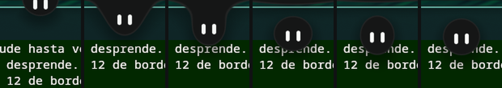

Hundida, colgando con el cuello, a punto de romper, recién soltada, el rebote, y
en reposo.

Al mirarlo en pantalla faltaban dos cosas que los números no dicen. **No se le
veían los ojos**: hundida, su centro cae casi sobre la superficie, así que unos
ojos centrados en él salen con la coronilla cortada por el borde y quedan en dos
rayitas. Se bajan dentro de la cara —los 7 de 56 que baja Marea, aquí 5,75— y se
ven enteros sin enseñar más de ella, que es de lo que va estar metida en el
borde.

Y **no parecía agua, parecía una cortina con un agujero**. El menisco estaba
bien, pero todo lo demás era rígido. Ahora:

| | |
| --- | --- |
| Ella se **estira** mientras cuelga | la superficie tira de ella y la afila: +11 % a mitad del viaje, y +17,6 % cuando la está volviendo a tragar |
| Al soltarse **se sacude** | −7,3 % achatada · +5,2 % afilada · −1,2 % · redonda. Tres botes en 400 ms, con un muelle propio poco frenado (`spring chapoteo = 420, 13`) |
| La superficie **da el tirón** | el bulto que hacía alrededor de ella se va de golpe y rebota: `impulse rebote -150` |
| Queda **una gota** colgando | y el agua se la traga en 520 ms |
| Y sale un **rizo** a cada lado | que recorre la lámina achicándose, 500 ms |

Lo que de verdad se ve es lo primero: son 46 px meneándose, no 12 de borde. El
rizo y la gota están, pero el borde de la pantalla deja doce píxeles de sitio y
ahí no cabe mucho más.

**Esta pieza no necesitó tocar el lenguaje.** Un muelle declarado, dos empujones
y cuatro formas más en el mismo `body`.

**Y asoma más de lo que dice el contrato.** «Algo menos de la mitad» deja su
centro 3 px por encima del borde, y con los ojos 2,5 por debajo del centro el
borde de arriba del ojo cae **por encima del de la pantalla**: se le ve el ojo
cortado por abajo, que es lo primero que se nota al mirarla. Asoma 29 de 46 y se
le ve la cara. Es una desviación a propósito, y está escrita en la escena.

**Lo que esto ahorra.** En QtQuick el menisco es `prototype/Meniscus.qml`: 162
líneas que calculan dos curvas Bézier, con sus puntos de control, el ángulo de
enganche a la bolita y el corte con la superficie, más los comentarios que
explican por qué cada tiro va hacia dentro y no hacia fuera. Aquí son dos formas
en el mismo `body` y un número que sube y baja. El cuello no se dibuja: aparece.

## Abrir y cerrar

| Lo que pide el contrato | Cómo está | Medido |
| --- | --- | --- |
| 290 ms al abrir | `card: 1 ~290ms` | 283 ms |
| El contenido entra detrás | `content: 1 ~200ms after 90ms` | empieza 102 ms después, dura 198 |
| Al cerrar, **primero el contenido**: 50 ms | `content: 0 ~50ms` | se va en 50 ms, tres frames |
| **Y luego** la geometría: 210 ms | `card: 0 ~210ms after 50ms` | arranca cuando el contenido ya no está, y tarda 210 |
| Se aparta para presentar la tarjeta | `let cx = 120 + (1 - card) * 240` | viaja con la propia apertura |
| El clic abre; el roce **no** | `on press cuerpo_zona { toggle open }` | acercarse no abre nada |
| Se cierra al salir, con 320 ms de gracia | `on away conjunto for 320ms { open = false }` | el conjunto incluye bolita, puente y tarjeta |

El orden inverso entre abrir y cerrar se escribe con dos reglas y se lee como el
contrato:

```
on change open while open      { card: 1 ~290ms;  content: 1 ~200ms after 90ms }
on change open while not open  { content: 0 ~50ms; card: 0 ~210ms after 50ms }
```

**Dos cosas que se vieron al mirarla, y que no se ven en los números:** la
tarjeta se salía por abajo de la superficie, y el bloque de lo que suena se
montaba encima de los deslizadores. La segunda era maqueta mía; la primera es que
**una superficie no crece con lo que lleva dentro, ni siquiera para una sombra**:
la de la tarjeta necesita 62 px por debajo (18 de desplazamiento y 44 de
difusión), y sin ellos se corta en seco contra el borde.

Que la superficie se declare a mano no es cosa de pleamar: en Marea también se
declara, y su techo subió a mano tres veces —520, 640, 880— con una nota en
`core/Theme.qml` diciendo que el síntoma no señalaba allí en absoluto. Lo que sí
era de pleamar es que no dijera nada. Ahora lo dice:

```
render · a shadow is cut: it needs 30 px below more than this 760 x 520 surface has.
         The shape fits; its shadow does not
```

Una vez, cuando la escena se queda quieta —no al primer píxel, que en una tarjeta
que se abre sería el número equivocado— y solo si la forma flota despegada de ese
borde: una barra pegada arriba tiene la sombra cortada por arriba porque quiere.
Es la segunda vez que construir Marea con pleamar acaba en pleamar y no en la
maqueta.

**Esta pieza no necesitó tocar el lenguaje.** Con `on change` y `while`, los
retrasos de las transiciones y los muelles dichos en tiempo, la coreografía salió
tal cual está escrita en el contrato. La tarjeta, en `evidencia/centro-de-control.png`,
al lado de su lámina (`design/concepts/2026-08-31-centro-y-apps`).

## El nivel en la cara

> «Los dos ojos se tumban y se juntan en una sola barra centrada, del mismo
> grosor que tienen ellos de ancho: es el mismo pill girado 90°. Esa barra es la
> pista de una barra de volumen normal, que se llena de menta de izquierda a
> derecha; el porcentaje aparece en la frente. 180 ms de entrada, se mantiene
> 1,1 s tras el último cambio y devuelve la cara. Se dispara con el deslizador
> del panel **y con la tecla de volumen del teclado**. En gris cuando está
> silenciado.»

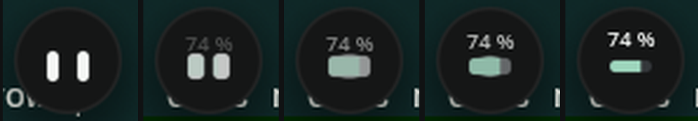

De izquierda a derecha, la misma cara con `meter` a 0, ¼, ½, ¾ y 1.

| Lo que dice el contrato | Lo medido |
| --- | --- |
| El mismo pill girado 90° | El ojo mide 5 × 13; tumbado, 13 × 5. No nace ninguna forma nueva |
| Una sola barra centrada | Los centros van de ±6,5 a ±2,5. El vuelo total es **18 de pie y 18 tumbados**: los ojos solo se ensanchan y se deslizan, nada pega un salto |
| Sin junta visible | Solapan 8, y las dos puntas redondas suman 5: la unión queda dentro |
| 180 ms de entrada | Muelle `~180ms`. Medido: 0 → 1 en 190 ms, con un 3 % de pasada que no se ve |
| Se mantiene 1,1 s tras el **último** cambio | Medido con tres cambios seguidos del volumen real: vuelve 1 102 ms después del tercero, no del primero |
| Se llena de menta de izquierda a derecha | Sí, y es **la misma pista pintada otra vez y recortada por la izquierda**: la menta tiene la forma exacta de la barra, con sus puntas, sin una geometría más |
| El porcentaje en la frente | `number(volume * 100, 0, " %")`, que sube 3 px mientras aparece |
| En gris cuando está silenciado | `mix(mint, #6b7280, muted)` |
| El deslizador y la tecla se ven igual | Ni una línea de lógica: `service audio { volume: number; muted: bool }`. Comprobado moviendo el volumen del sistema con `wpctl`, que es lo mismo que hace la tecla |

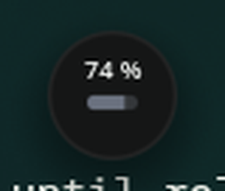

**Lo que aquí gana pleamar, y en QML no cabía.** Los ojos no se solapan: **se
funden**. Antes de tocarse les sale un puente entre medias, igual que a la bolita
con el borde, porque son un `body` y no dos cajas. Es una campana como la del
menisco —se tocan justo a la mitad del viaje, ahí está lo gordo, y a los extremos
no queda nada—, así que de pie son dos ojos limpios y tumbados una barra sin
cintura. En QML, dos `Rectangle` que se acercan se solapan y ya: para esto haría
falta dibujar una tercera forma que nadie mira.

**Lo que cuesta.** El episodio entero —subir, aguantar 1,1 s y volver— son 92
frames, y **683 ms de esos 1,1 s el render está dormido**: en cuanto el muelle se
posa deja de pintar, y la regla que espera no sondea nada, se apunta una cita.

## La cuenta, la cámara y el disco rojo

> **Grabación.** «La cuenta atrás ocurre DENTRO de la bolita: sus ojos se
> convierten en el número, con un rebote decreciente por segundo… con el ojo
> izquierdo convertido en disco rojo y siguiendo al puntero. El disco rojo se
> enciende cuando el grabador está corriendo, no al pulsar: es una afirmación
> sobre el presente.»
>
> **Fotografía.** «…vuelve con los ojos convertidos en cámara.»

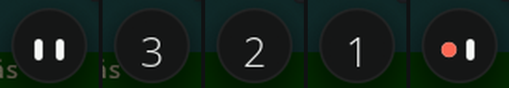

Y la cámara, con su obturador, y el disco antes y después de que el grabador
arranque de verdad:

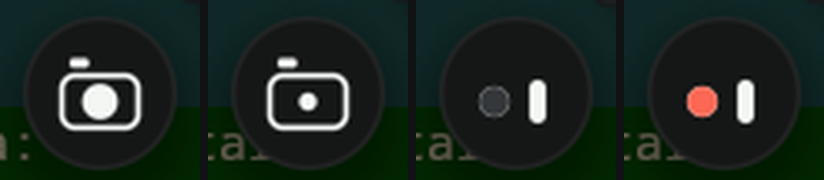

### Cómo está escrito

Todo esto es **una sola cadena**: el ojo de siempre, y cada estado tirando de
él. No hay formas que se intercambian ni una animación por estado peleando por
los mismos ojos; hay cinco muelles que siguen a un hecho con tipo
(`fact face: eye | count | camera | rec`), y la geometría se dobla hasta ser
otra cosa. Por eso cualquier estado puede interrumpir a otro a mitad de camino y
lo único que se ve es que la forma cambia de idea.

| Lo que dice el contrato | Lo medido |
| --- | --- |
| Tres números, uno por segundo | 1 000 ms, 1 000 ms, 1 000 ms |
| Rebote **decreciente** por segundo | Escala 1,25 · 1,17 · 1,08. Es un empujón a la velocidad del muelle (`impulse pop left * 2.5`), no una animación hasta un tamaño: cada golpe sale de donde estaba el anterior |
| «El último aterriza justo cuando arranca el grabador» | Del último número al disco: **17 ms**, un frame |
| El cero no se enseña | El número es `max(left, 1)`: el cero no es una cuenta, es el momento de empezar |
| El disco se enciende con el grabador, no al pulsar | Dos cosas separadas: `dot` es el disco (sigue a `face == rec`) y `red` es el rojo (sigue a `taping`). Primero el ojo se vuelve disco oscuro; el rojo llega cuando el grabador está |
| El derecho sigue siendo un ojo | Sí, y sigue al puntero: es lo que la mantiene viva mientras dura |
| Los ojos convertidos en cámara | El izquierdo se abre en el objetivo (13 de la lámina, 5 con el obturador) y el derecho se estira hasta el cuerpo (30 × 21, esquina 6). El visor es una marca aparte porque ya no quedan ojos |

### Las dos cosas que aquí son de pleamar y no de QML

**El número sale de los ojos.** Los dos se van al centro, se funden en una gota
—se funden de verdad, que para eso son un cuerpo— y la gota **se abre como un
diafragma**: crece mientras se le come el centro, se queda en un anillo, y
dentro estaba el número.

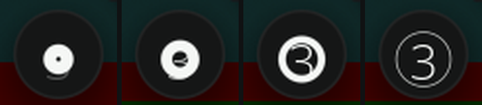

**El agujero es una forma más.** Ni el diafragma ni el cuerpo de la cámara se
dibujan con un borde: se les come el centro con una forma del color de la
bolita. Aquí todo son distancias, así que un hueco no es un caso especial. En
QML el cuerpo de la cámara es un `Rectangle` con `border` y el fondo
transparente, y el diafragma no existe porque un número blanco fundiéndose
sobre una gota blanca sale gris y turbio.

## La fotografía y la esquina de grabar

> **Fotografía.** «Anticipa 70 ms, se estira y sale por el borde superior en
> 150 ms; entonces se oculta, se congela la pantalla y vuelve con los ojos
> convertidos en cámara.»
>
> **Grabación.** «Ya cuenta desde la esquina que va a ocupar. Luego se mete en una
> esquina de la pantalla, asomando el 82 % de ella… La mirada se pliega sobre su
> lado visible.»

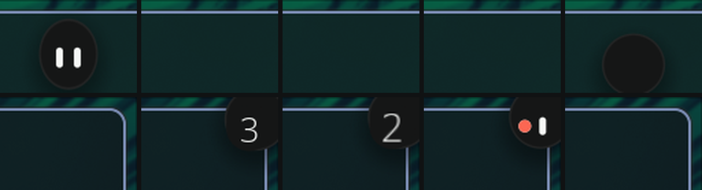

Arriba, su sitio de siempre; abajo, la esquina de la pantalla, que es **otra
superficie**. De izquierda a derecha: se estira para salir, ya no está y cuenta
desde la esquina, graba, y ha vuelto.

| Lo que dice el contrato | Lo medido |
| --- | --- |
| Anticipa 70 ms | Baja 3,3 px y se estira a 0,94 × 1,12 en 70 ms |
| Sale por arriba en 150 ms | A los 220 ms del aviso ya no está en el encuadre |
| Cambia de cara donde nadie la ve | `cam` pasa de 0 a 1 con ella fuera de la superficie |
| 200 ms de margen | 220 antes de volver |
| Vuelve hecha cámara | Cae con un muelle vivo y aterriza 3 px pasada: regresa, no «aparece» |
| El disparo: cierra 80, abre 170 | Un gesto sobre la pose `shut`, con un culatazo del cuerpo (1,05 × 0,95) que en Marea no está |
| Asoma el 82 % | Centro a 14,7 px del ángulo: 46 × 0,82 − 23 |
| Cuenta desde la esquina | La cuenta empieza al llegar arriba, con ella entrando ya por la esquina |
| La mirada se pliega | `min(gaze.x, 0)`, `max(gaze.y, 0)`: nunca mira hacia su mitad escondida |
| Pulsarla para | Y parar a mitad de cuenta la devuelve con sus ojos, no grabando |

**Ella viaja por los bordes.** Marea esconde una ventana y enseña otra. Aquí
sale de verdad por arriba —con el mismo gesto para la foto y para grabar— y
entra de verdad por la esquina, encajándose con un rebote contra el ángulo. La
cara es un `component`, así que en los dos sitios es la misma, con los mismos
muelles. Y la superficie de la esquina se queda abierta mientras quede algo de
ella dentro (`open: tuck > 0.01`), así que al parar se desliza fuera en vez de
desaparecer con la ventana.

### Acercarse saca el reloj y «Detener»

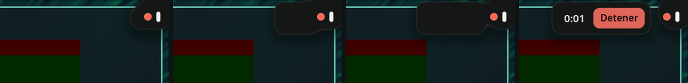

En Marea es un rectángulo que se funde en 150 ms a su lado. Aquí **sale de
ella**: es el mismo cuerpo, que se estira hacia dentro de la pantalla como una
gota, hace cuello a mitad de camino y se separa hasta quedar a 8 px. El
contenido entra tarde, cuando el panel ya se ha despegado —antes el botón
quedaba debajo de su cara—. Se recoge con 320 ms de gracia, porque el hueco
entre ella y el panel es real y no puede perderse al cruzarlo.

El reloj lo cuenta el render (`every 1s while taping`) y lo escribe un hueco
nuevo de pleamar: `{secs, time}` → `0:07`. Comprobado con el ratón de mentira:
acercarse lo saca, el botón se enciende al pasar, y pulsar «Detener» la
devuelve arriba.

### Las cuatro esquinas

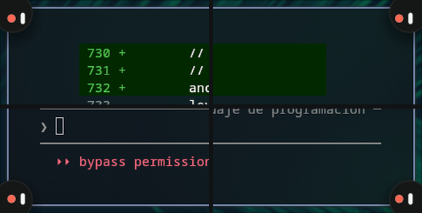

El contrato dice que la esquina **se elige para que caiga fuera de lo grabado**.
Quien sabe qué se está grabando es la lógica, así que aquí sólo se obedece: un
hecho con tipo, `fact rincon: top_right | top_left | bottom_right | bottom_left`,
y la superficie se pega a ese borde. Se cambia **en marcha**, sin volver a crear
nada: es lo que le faltaba a pleamar y lo que ahora hace `anchor: rincon`.

Todo lo que cuelga de ella sigue al rincón: por qué ángulo entra y sale, hacia
dónde se pliega la mirada, y por qué lado sale el panel del reloj —siempre hacia
dentro de la pantalla, nunca fuera—.

| | Centro de ella | Panel |
| --- | --- | --- |
| `top_right` · `bottom_right` | a 14,7 px del ángulo derecho | a su izquierda |
| `top_left` · `bottom_left` | a 14,7 px del ángulo izquierdo | a su derecha |

**Lo que no se puede todavía:** fuera de su superficie no sabe dónde está el
puntero —Wayland no lo dice, es la limitación S5 de pleamar—, así que en la
esquina solo sigue al ratón cuando lo tiene encima.

## La nota de la hora

> «La nota se despliega desde detrás de la bolita, con la hora y la fecha. Un clic
> en ella abre el calendario. 180 ms de espera antes de salir, 170–190 ms de
> aparición y 300 ms de gracia al salir el puntero, porque el hueco entre bolita y
> nota es real y no puede perderse al cruzarlo. Desaparece si se abre el panel.»

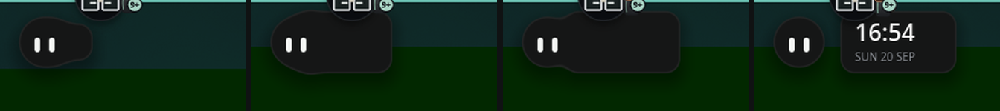

| Lo que dice el contrato | Lo medido |
| --- | --- |
| Sale de detrás de ella | Nace en su centro con ancho cero y se desliza hasta quedar a 14 px. Es una forma más de **su mismo cuerpo**: una sola sombra, un solo borde, y un cuello a mitad de camino |
| 180 ms de espera | `on hover cuerpo_zona for 180ms` |
| 170–190 ms de aparición | Muelle `~190ms` |
| 300 ms de gracia | Medido: el puntero sale a los 3 000 ms y la nota se recoge a los 3 300 |
| La hora y la fecha | `service clock { time; date }`: las trae el sistema, sin lógica, y despierta una vez por minuto |
| Un clic abre el calendario | `emit calendar`, que la lógica oye |
| Desaparece si se abre el panel | `follow nota = if(note and not open and face == eye …)` |

**Y no se hunde con la hora en la mano.** En modo oculto había un `away` de 2,6 s
sobre ella, y salir de ella *hacia la nota* ya contaba. Ahora hay un solo reloj
de gracia para todo lo que la necesita —puntero, nota, tarjeta—, escrito con
`on still`: 2,6 s desde que lo último deja de necesitarla. Medido: la nota se
recoge a los 3 300 ms y ella empieza a hundirse a los 5 900.

## El oleaje de avisos: llega uno

> «Una tarjeta pequeña entra en horizontal a su lado —quién, la primera línea y
> «ahora»— y ella la mira. Se queda lo que hace falta para leerla, y luego se
> estrecha hasta ser una gota del color de su categoría y vuela a su sitio, por
> una curva. Al llegar, un trago pequeño. Entrada 220 ms. Lectura 3,2 s, que el
> puntero encima detiene. Vuelo 220 ms.»
>
> «Hasta cuatro gotas, una por categoría y la más reciente primero, bajando por su
> lado derecho desde el hombro, cada una con su número dentro —«9+» a partir de
> diez—. La gota donde cae algo late una vez. Nada en bucle.»

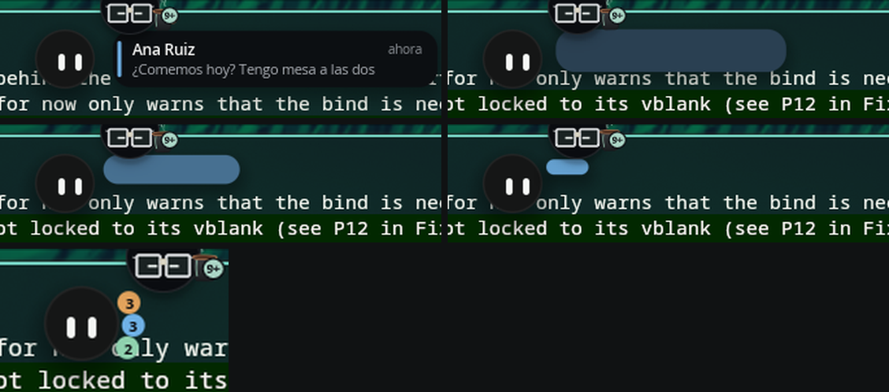

| Lo que dice el contrato | Lo medido |
| --- | --- |
| Respingo de 8 px, ojos muy abiertos, aterrizaje elástico | El gesto `alert` de Marea, fotograma a fotograma, por 46/56 |
| Entrada 220 ms | `entra ~220ms`; si está hundida, espera a que haya salido |
| Ella la mira | La mirada deja al ratón y se va a la tarjeta mientras se lee (`atenta`) |
| Lectura 3,2 s, que el puntero detiene | `on still marca for 3.2s while … not sobre`: salir de encima vuelve a contar. Medido: 3 200 ms desde que ella está fuera |
| Se estrecha hasta ser una gota de su color | Una sola forma: ancho, alto, esquina y color van con `mine` |
| Vuela por una curva, 220 ms | De lado a ritmo constante y hacia arriba deprisa: `1 − (1 − mine)²` |
| Al llegar, un trago | Gesto `gulp`, y la gota late una vez con un `impulse` |
| La más reciente primero | El sitio de cada gota es cuántas hay más recientes, y viaja a él **por el arco**: se anima el ángulo, no la x y la y, así que se corren hombro abajo sin atajar por dentro de ella |
| Número dentro, «9+» desde diez | Sí |

**El orden es el de llegada, no el de aterrizaje.** El que se está leyendo
aterriza 3,2 s después que los que llegan mientras tanto, pero llegó antes: cada
aviso guarda su turno. Comprobado con tres seguidos: mensajes, calendario,
sistema → sitios 2, 1 y 0.

### Y si llegan varias

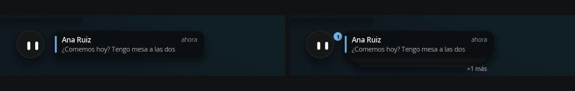

> «Las tarjetas se apilan —tres a la vista y «+N más»— y vuelan juntas, cada una
> un poco después de la anterior. Un solo boing con los ojos curvados, lleguen
> las que lleguen. Lectura 4,2 s; vuelo 280 ms.»

| Lo que dice el contrato | Lo medido |
| --- | --- |
| Tres a la vista y «+N más» | Sí; las de detrás asoman 8 px y son 22 más estrechas cada una |
| Vuelan juntas, cada una un poco después | 45 ms entre una y la siguiente |
| **Un solo boing**, lleguen las que lleguen | El gesto solo lo pide la primera. Una mascota que pega un bote por cada mensaje de un grupo es una mascota que se acaba apagando |
| Lectura 4,2 s | Y 3,2 si viene sola. Son dos reglas, porque el `for` de una regla es un tiempo escrito y no una cuenta |
| Vuelo 280 ms | Sí |
| La que llega vuelve a empezar la lectura | Sí: `marca` se mueve y `on still` cuenta de nuevo |

Y las de detrás no llevan su color hasta que vuelan: mientras esperan son papel
apilado, y el color es de la que se está leyendo.

### La vista previa

> «Con avisos pendientes, pasar por encima abre las gotas en abanico debajo de
> ella, con el icono de su categoría, y enseña el más reciente. Ocupa el sitio de
> la nota de la hora. Pulsar una gota abre la bandeja en esa categoría. 160 ms;
> se cierra al irse el puntero.»

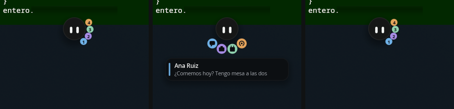

Recogidas, abiertas y recogidas otra vez.

| Lo que dice el contrato | Lo medido |
| --- | --- |
| Se abren en abanico debajo de ella | Todo el abanico gira 69° y se aleja 10, **por el arco**: bajan rodeándola y no atajando por dentro. Abiertas se separan 30° en vez de 26, para no tocarse |
| Con el icono de su categoría | Recogida enseña su cuenta; abierta, su icono. Lo que dice cambia porque lo que preguntas es otra cosa: recogida, cuántos hay; abierta, de quién |
| Enseña el más reciente | Una tarjeta debajo con quién y la primera línea, que entra cuando las gotas ya están puestas |
| 160 ms | Muelle `~160ms` |
| Ocupa el sitio de la nota de la hora | O una, o la otra: con algo pendiente sale el abanico, y sin nada, la hora |
| Se cierra al irse el puntero | Con 300 ms de gracia sobre el conjunto entero —ella, el abanico y la tarjeta—, porque los huecos entre las tres son reales |
| Pulsar una gota abre la bandeja en esa categoría | `cat = k` y a abrir |

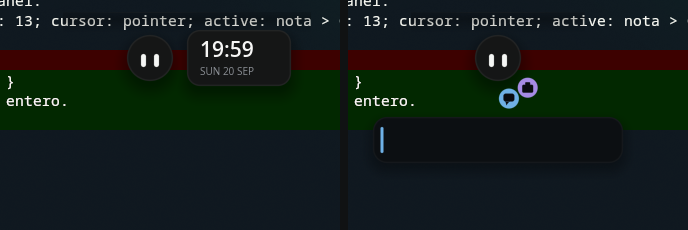

Sin nada pendiente, la hora. Con dos avisos, el abanico en su sitio.

**Lo que falta de esta parte:** la llegada con ella dormida, que necesita el
estado de dormir.

### Lo que esto destapó en pleamar

Haciendo volar la gota, **el render se quedaba parado 300 ms a mitad de vuelo**:
la gota se congelaba y aparecía en su sitio. No era de esta escena. Con el
depurador: parado en `vkAcquireNextImage`, esperando a que el compositor
devolviera una imagen. Dos cosas eran de pleamar —una superficie *cerrada* podía
marcar el ritmo con vsync, y al despertar se presentaban tres frames en 2 ms— y
la tercera es de Hyprland con NVIDIA. Ahora se presenta por buzón y el render se
marca el paso. El frame más largo en vuelo pasó de **300–780 ms a 17**.

Para una alternativa a Quickshell cuyo argumento es la fluidez, esto valía más
que la gota.

## El centro de control

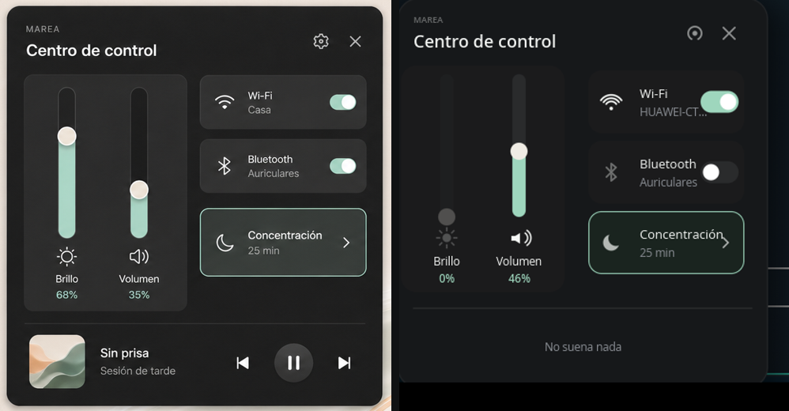

A la izquierda la lámina
(`design/concepts/2026-08-31-centro-y-apps/centro-de-control.png`), a la derecha
lo que sale. El panel mide 593 de ancho en la lámina y 390 aquí, así que las
alturas salen de medir la lámina y multiplicar por 390/593, no de mirarlas a
ojo: la cabecera acaba en −150 desde el centro de la tarjeta, el contenido
empieza en −134, el filete va en +121 y la música en +161.

Eso lo aprendí a la tercera: la columna de la derecha la había puesto en −165 y
se le subía encima a la cruz de cerrar.

| | |
| --- | --- |
| **Los dos niveles** | Brillo y volumen, con el icono **debajo** de la pista, el rótulo y el tanto por ciento en menta. Pista fina, relleno de menta y tirador crema |
| **Tres tarjetas** | Wi-Fi, Bluetooth y Concentración. Las dos primeras con interruptor; la tercera abre una página, y eso es una flecha. Concentración puesta lleva filo de menta: es el único borde del panel |
| **El engranaje y la cruz** | Arriba a la derecha, como en la lámina |
| **La línea y lo que suena** | Un filete separa lo de arriba de la música |

**Antes puse otra cosa.** Había copiado el `ControlCenter.qml` de ahora —seis
tarjetas, salida y micrófono, una franja de órbita— que ya no es esta lámina. No
se parecía en nada.

### Y ahora funciona

El interior no era interactivo, y la causa era concreta: **una regla no puede
mandarle nada a un servicio**. El render sabe reaccionar al ratón, pero pedirle
algo al sistema es de la lógica. Este prototipo no tenía ninguna; ahora hay un
`bolita.luau` de cuarenta líneas, que es todo lo que hace falta:

```lua
on("mover_volumen", function(v) sys.call("audio.volume", v) end)
on("mover_brillo", function(v) sys.call("brightness.level", v) end)
on("tocar_pausa", function() sys.call("media.toggle") end)
```

Medido arrastrando con el ratón de mentira: el volumen del sistema va de 0,79 a
0,27 siguiendo al dedo, y la pista lo sigue leyendo **del servicio**, así que
subirlo con la tecla del teclado mueve esta misma pista sin que nadie lo cuente
dos veces.

**Lo que no se puede accionar, y por qué.** El brillo dice 0 % y sale apagado:
esta máquina es un sobremesa y no tiene retroiluminación, así que el servicio
contesta `present = false` y la escena lo enseña en vez de mentir. Y los
interruptores de Wi-Fi y Bluetooth están dibujados pero no hacen nada: pleamar
sabe **leer** la red y no cambiarla, y de bluetooth no sabe nada todavía. Está
apuntado como su limitación B15. Un interruptor que se mueve sin hacer nada es
mentira, así que no se mueve.

### También brota de ella

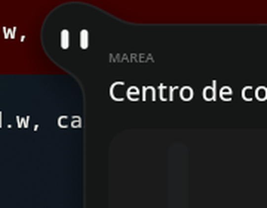

Igual que la bandeja: el panel va en el mismo `body` que su cuerpo, se solapan
17 px, y entre los dos hay un cuello que nadie dibuja. No es una tarjeta que
aparece al lado; es ella, estirada.

### Y con maquetación, sin un solo ancho a mano

Las tres tarjetas se pisaban: el nombre de la red se metía debajo del
interruptor y «Concentración» le daba a la flecha. Era que yo las estaba
colocando a mano con coordenadas y adivinando los anchos.

Ahora cada tarjeta es una `row` de tres —el icono, lo que se lee, y el
interruptor o la flecha— dentro de una `column`. Lo del medio pide el sitio que
sobra con **`grow: 1`** y sus textos lo cogen de ancho, así que **en esta parte
de la escena no hay un solo ancho escrito**: lo que no cabe acaba en puntos
suspensivos solo, y la que lleva flecha en vez de interruptor tiene más sitio
porque la flecha ocupa menos.

`grow:` no existía cuando empecé esto. Era la G28 de pleamar, y salió de aquí.

```plm
row tarjeta { size: 173, 66; gap: 6; padding: 8; fill: …; corner: 14
    group { size: 20, 22;  …el icono… }
    column { grow: 1; gap: 2
        text titulo.$k { size: 13; lines: 1; color: ink }
        text sub.$k { size: 11.5; lines: 1; color: #8b8f95 }
    }
    group { size: if(k < 3, 40, 12), 23;  …interruptor o flecha… }
}
```

### Lo que estaba descentrado

Dentro de cada tarjeta el interruptor se quedaba pegado arriba y el icono de
Wi-Fi caía alto. Dos causas, las dos dichas mal por mí:

- **Un reparto alinea a `start`.** Sin `align: center`, cada hijo se pega al
  borde de su eje corto. El texto parecía centrado porque son dos líneas que
  llenan el alto; el interruptor, que mide 23, no.
- **Un `arc` se dibuja POR ENCIMA de su punto.** Es una tajada de círculo que
  abre hacia arriba, así que su masa va de `y−16` a `y+2`: para centrarlo hay
  que bajar el punto 7. Con el punto en el centro, el icono sale alto.

Y una tercera que sí era de pleamar: con `size:` dicho, `align:` seguía
centrando **respecto al hijo más alto** y no dentro de la caja pedida, así que
una tarjeta de 66 con 32 de contenido lo dejaba todo arriba y el hueco abajo.
Ahora, a lo ancho del eje, lo dicho en `size:` es la caja en la que se alinea.

### Las páginas, que salen de su tarjeta

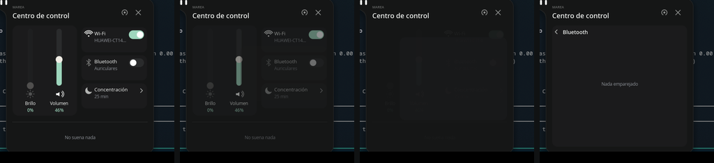

Pulsar una tarjeta abre su página, y **la página sale de la tarjeta**: crece
desde su sitio hasta llenar el panel, mientras la portada se va. No es una
pantalla que sustituye a otra; es la misma tarjeta, abierta. Es el mismo gesto
que la bandeja saliendo de ella, un piso más abajo.

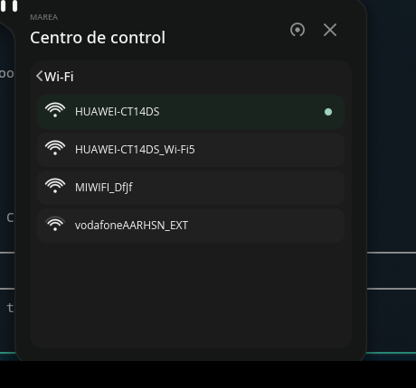

Y traen datos de verdad de esta máquina:

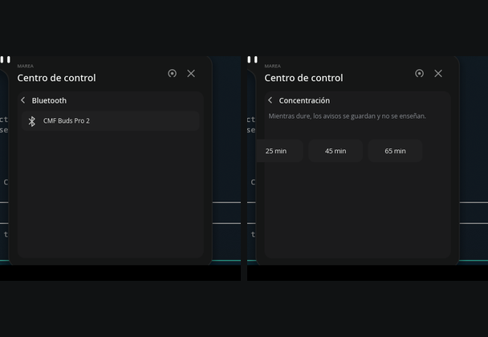

| | |
| --- | --- |
| **Wi-Fi** | Las redes que hay, con su fuerza en los mismos arcos del icono, la puesta marcada, y una misma red una sola vez —sale una por antena, y se queda la que mejor llega— |
| **Bluetooth** | Lo emparejado, con lo conectado marcado |
| **Concentración** | Lo que hace, dicho, y tres duraciones |

**Y el interruptor enciende y apaga de verdad.** Tiene su propia zona encima de
la de la tarjeta: pulsarlo conmuta la radio, y pulsar el resto abre la página.
Antes el cuerpo se llevaba las dos cosas y el interruptor no hacía nada, así que
con la Wi-Fi apagada **no había manera de volver a ponerla desde el panel** —un
interruptor que solo apaga no es un interruptor—. La lógica lee primero el
estado y pone el contrario, en vez de suponerlo: si alguien lo ha cambiado por
fuera, esto sigue acertando.

**Y aquí la lógica se gana el sueldo.** pleamar sabe **leer** la red y no
listarla ni cambiarla —es su B15—, y de bluetooth no sabe nada. Así que esto no
lo hace la escena: lo hace `bolita.luau` preguntándole a `nmcli` y a
`bluetoothctl`, que es justo para lo que está la lógica. La escena no manda
nada; cuenta lo que le dicen.

Pulsar una red la pone, **pero solo si ya estaba guardada**: `connection up` no
se inventa una contraseña, así que esto no se mete en la red del vecino. Una
nueva pide su clave, y eso es una conversación, no un clic. Y el `mac` de cada
auricular viaja en su registro aunque la escena no lo declare: es donde la
lógica guarda lo que la escena no necesita saber.

### Y el cierre, en tres tiempos

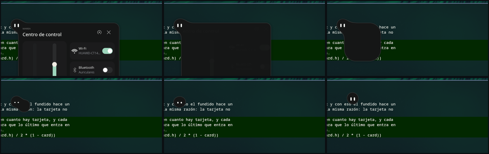

> «Se aparta para presentar la tarjeta; al cerrar funde primero el contenido y
> luego recoge la geometría hasta la bolita. | 290 ms al abrir; 50 ms de fundido
> + 210 ms de cierre.»

Los tiempos del contrato estaban, pero las tres cosas pasaban **encima de la
otra**: la tarjeta se encogía mientras ella ya se había ido, así que no se bebía
nada; se quedaba una caja sola apagándose en una esquina. Ahora van en orden, y
ese es todo el truco:

| | |
| --- | --- |
| se apaga lo que se lee | 50 ms |
| se la bebe: la tarjeta se estrecha hacia ella —el cuello se pincha solo, que ya estaba— | tragada a los **234 ms** |
| da el trago cuando ya casi no queda | `on change card < 0.2` |
| y **entonces** vuelve a su sitio | arranca a los 200, cruza su sitio a los **417**, se pasa **19 px** y se asienta a los **733** |

Tres detalles que hacen que eso sea un líquido y no una caja:

**La esquina engorda al irse.** `corner: max(22 * card, min(w, h) / 2 * (1 - card))`:
la de la lámina manda en cuanto hay tarjeta, y cuanto menos queda de ella más
gorda es su esquina en proporción, así que lo último que entra no es una cajita
con picos —es una gota—. Abriendo pasa al revés: sale como un bulto de ella y se
va cuadrando al llegar a su tamaño.

**Vuelve con su propio muelle.** Su sitio ya no es «lo abierta que está la
tarjeta»: es un `prop` aparte (`sitio`) con un muelle menos frenado
—`spring vuelta = 165, 16`—, así que llega pasándose un pelo y se asienta, en
vez de aparecer otra vez ahí. Y el camino se comba: la altura va por el
cuadrado, así que sale y entra **por arriba** en lugar de cruzar en diagonal.
Una cosa con peso no viaja en línea recta.

**Y se inclina hacia donde va, sin que nadie se lo diga.** Sale de la
**velocidad de su propio muelle**: `follow lean = clamp(vel(sitio) * -2.6, -8, 8)`.
Se inclina al arrancar, se endereza al llegar, y lo hace igual de ida que de
vuelta porque es la misma cuenta. Máximo medido: 7,4°.

Al llegar, el agua del borde se entera: se hunde un poco a su alrededor y rebota
—3,8 px de meneo—, como cuando algo se posa en una superficie que no es rígida.

**Y volver a hundirse también se ve.** Salir del agua tenía dos botes, una onda
que recorre la lámina y una gota que se queda; meterse no tenía nada, se iba en
silencio. Ahora, cuando acaba de entrar, la superficie **se cierra sobre ella**:
se hunde donde estaba y de ahí sale el mismo rizo, 760 ms. Irse también es algo
que pasa.

### Lo que esto destapó en pleamar

**No había servicio de brillo.** Es la primera pista que busca cualquiera en un
centro de control. Ahora `brightness.present` y `brightness.level`.

**`show:` no hacía nada** fuera de la copia de un componente, y estaba ofrecido
en todo. Ahora funciona donde está ofrecido, y apaga también la zona.

**Y una zona declarada al final se come los clics de todo lo que hay debajo.** Me
ha pasado tres veces: con el panel de la esquina, con las filas del oleaje y con
este panel entero. La pulsación es de la zona de más arriba, y «más arriba» es la
última declarada. Las zonas de gracia van debajo.

## La bandeja: el oleaje

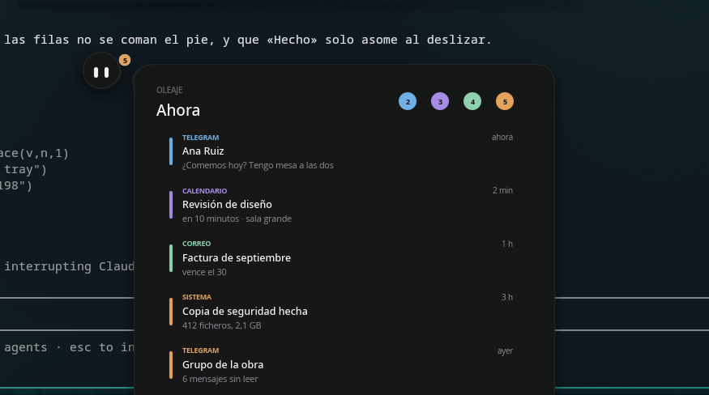

**La tarjeta no aparece al lado: brota de ella.** Va en el mismo `body` que su
cuerpo, así que comparten silueta, sombra y filo, y entre las dos hay un cuello
que nadie dibuja —sale de fundirlas, como el del borde del agua—.

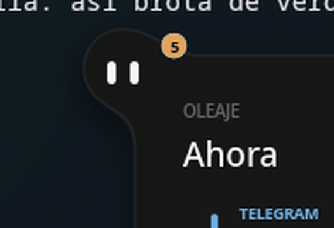

Esto costó entenderlo: con el hueco de 40 px que lleva la otra tarjeta no había
nada que fundir y se quedaban en dos cosas juntas. Se solapan 17 y entonces el
fundido hace un cuello de verdad.

### Abre Oleaje

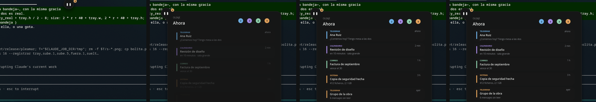

> «Ella sube 5 px, la tarjeta brota de ella, las gotas se van al carril —que
> entra desde pequeño— y las filas llegan una tras otra. 240 ms; una fila cada
> 35 ms.»

| Lo que dice el contrato | Lo medido |
| --- | --- |
| Sube 5 px | Sí, con la tarjeta |
| La tarjeta brota de ella | Un `blend` que es una campana al abrir y se queda en 24: cuello grueso mientras sale, fillet cuando está |
| Las gotas se van al carril | De su hombro a la cabecera, **por el arco**: lo que se anima es el ángulo, así que salen rodeándola en vez de atajar por dentro |
| Una fila cada 35 ms | 35, y cada una entra subiendo 26 px con un muelle vivo. Eso es el oleaje: no es una lista que aparece, es una que llega |
| Al cerrar, 320 ms | Y se vacía **de abajo arriba**, que es como se vacía algo de verdad |

### Resolver un grupo

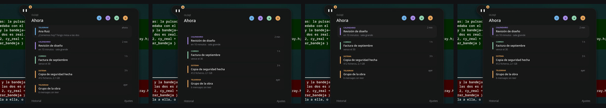

> «La fila se va a la derecha, una gota vuelve volando a ella, el número de su
> gota baja con un toque.»

La gota **nace pegada a la barra de color de su fila** y se despega al salir: el
pellizco no se dibuja, sale de las distancias. Medido de un clic: la fila fuera
en 220 ms, la gota en su hombro a los 380, y la cuenta de su categoría baja de 2
a 1 con su latido.

Y las de abajo **suben a ocupar el hueco**. Esto no sale gratis: en pleamar un
modelo no tiene identidad todavía (su limitación G12), así que el sitio de cada
fila es «cuántas vivas tengo encima», escrito fila por fila, y un muelle que lo
sigue.

### Deshacer, con su mecha

> «"Deshacer" durante 5 s, con una mecha que se consume.»

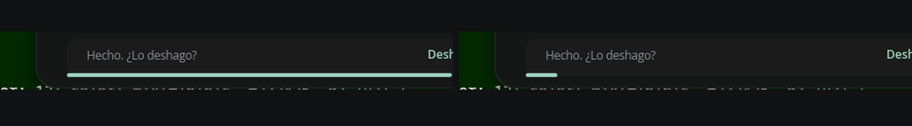

Recién hecho y a punto de apagarse.

Cinco segundos exactos y **a ritmo constante** no los da un muelle: los da un
gesto, que es una línea de tiempo con su curva. `5s linear { mecha: 0 }`, y al
acabar el fotograma siguiente emite que se apagó. Es lo que hace que una mecha
parezca una mecha y no algo que frena al final.

Medido: la mecha va de 1,00 a 0,02 en 4,7 s y se apaga sola. Y deshacer
devuelve la fila —sube a su sitio— y la cuenta de su gota vuelve a subir con su
latido: comprobado con el ratón de mentira, `viva.1` de 1 a 0 y otra vez a 1,
`n.1` de 2 a 1 y otra vez a 2.

Mientras se puede deshacer, la mecha ocupa el sitio del pie: es más urgente que
un enlace a «Historial».

### Deslizar: hecho o descartado

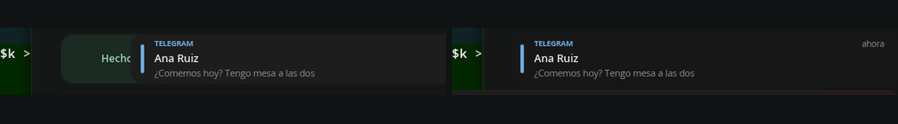

> «"Marcar leído" o deslizar la fila, que descubre "Hecho" y "1 h"… Descartar no
> manda gota: lo descartado no vuelve.»

La fila sigue al dedo, y al soltar decide: pasados 92 px se va por donde iba, y
si no vuelve sola con su muelle. Hacia la derecha, **Hecho**, y una gota vuelve
volando a ella. Hacia la izquierda, **Descartar**, y **no vuelve nada**: eso es
lo que las distingue, y es lo que dice el contrato.

Medido: deslizando a la izquierda, `viva` se apaga y la cuenta de su gota **se
queda donde estaba**; a la derecha, se apaga y la cuenta **baja**, porque la
gota llegó.

Lo que se descubre va en el hueco que la fila deja, no siguiéndola: puesto sobre
ella quedaba debajo y no se veía nunca. Y un toque —soltar donde se pulsó— es
abrirlo, no marcarlo: `on press` no vale aquí, porque arrastrar empieza por
pulsar y lo daría por hecho al primer píxel.

### Un urgente no se agrupa

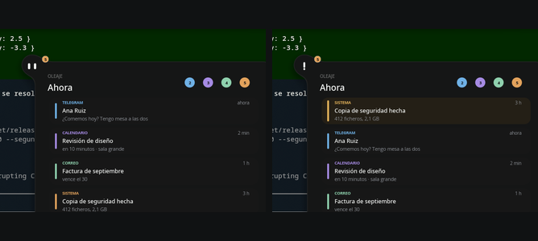

> «Un urgente no se agrupa: fila propia, arriba y en ámbar. Abre la bandeja sin
> quitar el teclado, y en ella una admiración en la cara, una gota de sudor y un
> salto corto.»

El sitio de cada fila es «cuántas vivas van antes que yo», y un urgente va antes
que todas: el suyo pasa de 2,94 a 0 y las demás bajan. El ámbar le pisa el color
de su categoría, porque lo que importa de esa fila ya no es de quién es, es que
corre prisa.

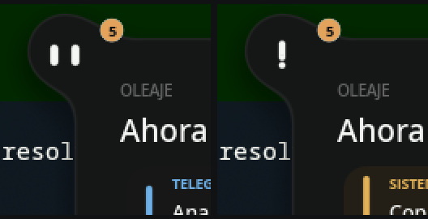

Y la cara se alarma: el ojo izquierdo se estira en el palo y el derecho se hace
punto, los dos al medio —un «!» descentrado no es un «!»—, con el salto corto de
Marea. **Una vez por episodio**, desde el primero hasta que no queda ninguno: un
aviso que salta cada vez es un aviso que se acaba tapando con una ventana.

### El modo demostración, y lo que destapó

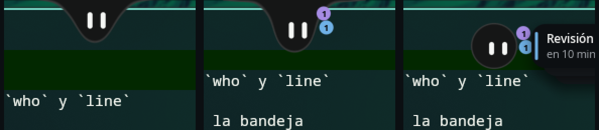

Hasta ahora los cinco avisos eran texto fijo en la escena y `notice` lo
disparaba yo a mano con `--decir`. Ahora los suelta la lógica: una tanda que
entra sola —uno, otro, **dos seguidos** para ver la ráfaga, otro, y un urgente
al final— y que llena la bandeja con lo que va llegando. Lo que cruza la
frontera es exactamente lo que mandaría el servicio de verdad: `cat`, `who`,
`line` y el suceso.

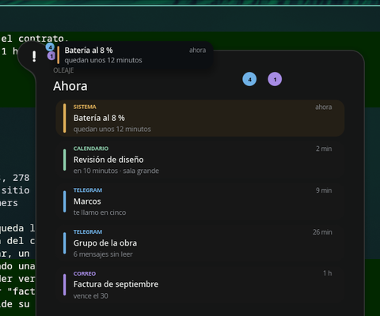

pleamar **sabe recibir las notificaciones del escritorio** —`sys.watch(
"notifications")` da la lista viva y `notifications.invoke` / `dismiss` actúan
sobre ellas—, pero aquí ese permiso no está dado a propósito: el primero que lo
pide se queda el sitio, y en esta máquina ese sitio es de Marea. Un prototipo no
le quita los avisos a la barra de verdad. El día que se dé el permiso, lo único
que cambia es de dónde salen.

**Y el primer aviso de verdad destapó un fallo que llevaba semanas escondido:**
el color de una fila salía de **su sitio en la lista**, no de su categoría. Con
cinco filas de ejemplo —una por categoría, y justo en ese orden— no se notaba
nunca; en cuanto llegaron dos de Telegram seguidos, salieron de colores
distintos. Es exactamente para lo que sirve enchufar una cosa a datos que no has
elegido tú.

### El sudor, la gota que sube, y lo que sobraba

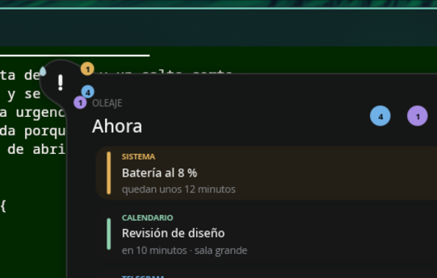

> «Un urgente no se agrupa: fila propia, arriba y en ámbar. Abre la bandeja sin
> quitar el teclado, y en ella una admiración en la cara, **una gota de sudor y
> un salto corto**; **la gota ámbar sube y se queda arriba mientras dure**.»

- **La gota de sudor** sale con la admiración, resbala 9 px y se va: **1 266 ms**
  medidos. Es una reacción, no un estado —lo que dura lo que dure la urgencia es
  la otra— y va a su izquierda, porque a la derecha le acaba de salir la bandeja.
- **La admiración es una reacción, no un estado.** Dura el susto —1 737 ms
  medidos— y se va. Lo que se queda «mientras dure» es la gota ámbar, que para
  eso sube. Estaba colgada de que no quedara ningún urgente, y como un urgente
  sin resolver no se va solo, se quedaba con el «!» puesto toda la tarde. El
  «una vez por episodio» tampoco puede colgar de la cara si la cara vuelve: lo
  lleva su propio hecho, que se limpia cuando no queda ninguno.
- **Y hundida, el abanico entero baja 30°.** Ahí arriba está el borde de la
  pantalla, y la gota de arriba —que ahora es la del urgente— se salía por él.
  «Nada sobresale por encima de su cabeza» vale también cuando la cabeza está
  medio metida.
- **La gota ámbar sube y se queda.** La de la categoría que tiene algo urgente se
  va al sitio 0 —lo alto del hombro— y las demás bajan uno para dejárselo;
  medido: **416 ms** en llegar, y de ámbar mientras dure, igual que su fila.
  Al resolverlo, cada una vuelve a su sitio por recencia sin que nadie las
  recoloque: el sitio de una gota siempre ha sido «cuántas hay más recientes que
  yo», y ahora es eso mismo con el urgente por delante.
- **Y el respingo, cuando ya se la ve.** Estaba puesto desde el principio, pero
  si el aviso llegaba con ella hundida el gesto se lo daba **debajo del agua**
  —620 ms de viaje— y al asomar ya se había acabado. Ahora salta al salir.

Dos cosas más que se vieron al verlo entero y no en capturas sueltas:

- **La tarjeta pequeña se quedaba encima de la bandeja**, diciendo lo mismo que
  su primera fila. Ahora, al abrirse el oleaje, se va: no desaparece, **sale
  volando a su gota**, que es el viaje que tenía que hacer igualmente. Medido:
  **367 ms** desde que abre la bandeja.
- **Y la bandeja que se abría sola se quedaba abierta para siempre.** `away`
  solo cuenta para quien estuvo dentro, así que una bandeja que abrió un urgente
  y que nadie llegó a visitar no se cerraba nunca. Ahora, si a los **7 s** nadie
  se ha acercado, se cierra sola; si estás encima, no.

**Lo que falta de la bandeja:** nada de esto. Queda la llegada con ella dormida,
que necesita el estado de dormir.

## El Remanso

> «La campana tachada del centro de control cierra la tarjeta y deja a Marea
> despierta dentro de una membrana que comparte exactamente su diámetro
> configurado. La luna queda en el cuadrante superior derecho y el agua cambia
> suavemente de pendiente, sin mover el cuerpo ni las perlas.»

No molestar, pero **despierta**: sigue aquí, atenta, y guarda lo que llega
mientras tú te concentras. Todo lo que pasa dentro pasa **dentro de su
silueta**: entrar en Remanso no la agranda ni un píxel.

### Entrar

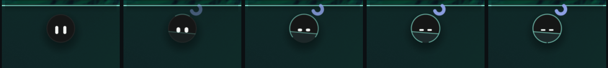

> «Una onda recorre una vez la membrana, aparece la luna azul y los ojos bajan a
> dos trazos relajados. Las categorías pendientes pasan a ser perlas bajo la
> línea de agua. | 320 ms; después queda completamente quieta.»

Aquí no hay campana tachada: hay una tarjeta de **Concentración**, que es lo que
trae la lámina del centro de control, y su página es donde eliges cuánto dura.
Al pulsar un plazo, **lo primero que pasa es que el panel se cierra**: quedarse
abierto encima de ella sería lo contrario de lo que acabas de pedir.

La membrana es un `arc` del **mismo radio que ella** con `span: 360deg * dibuja`,
así que la ola que la dibuja es la propia cuenta creciendo: no hay dos formas,
hay una que se va cerrando. Medido: `calma` de 0 a 99 % en **317 ms**, y la ola
arranca 33 ms después y tarda otros **317** —el `after 30ms` está para que se
vea empezar, no para que empiece antes que ella—.

### La marea

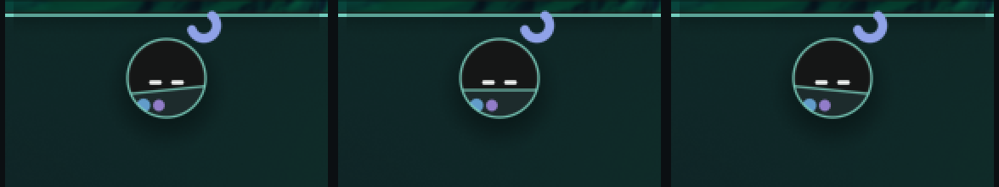

> «El agua cambia suavemente de pendiente, sin mover el cuerpo ni las perlas. |
> La marea completa una ida y vuelta en 7,6 s.»

`wave marea = 1 at 0.827`: 2π/0,827 = 7,597 s. Medido entre dos pasos por cero
subiendo: **7,60 s**. Es lo único que se mueve ahí dentro, y se mueve como el
agua. Los tres fotogramas están tomados cada 1,9 s, que es un cuarto de viaje.

El agua va recortada a ella (`clip inset 0 ellipse`), así que la línea **se corta
sola** donde acaba su silueta: no hay que calcular dónde.

### Lo que se guarda

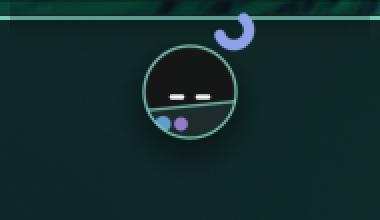

> «El aviso se guarda sin tarjeta, salto ni apertura. Su categoría aparece o
> aumenta bajo la línea de agua; el contador se actualiza en la cápsula. | Sin
> trayectoria exterior ni bucle.»

Tres avisos —dos de mensajes, uno de trabajo— y lo que se ve son dos perlas, la
azul más gorda. Medido: `n.1 = 2`, `n.2 = 1`; la perla aparece en **317 ms**,
engorda 0,6 px por aviso hasta tres y late una vez cuando cae otro, con el mismo
empujón que usa la gota del hombro: es la misma noticia contada en otro sitio.

Y en el hombro no queda ninguna gota: `follow hay.$k = … * (1 - calma)`. Ahí
abajo son perlas.

### Una urgencia permitida

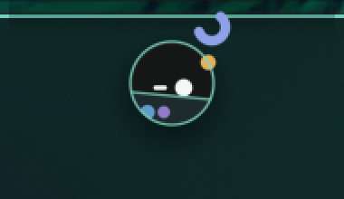

> «Una perla ámbar aparece sobre la membrana y solo el ojo cercano se vuelve
> redondo para mirarla. La bandeja no se abre y el foco no cambia. | 1,1 s; una
> vez por episodio urgente.»

Medido: `mirada` 0 → 1,03 → 0 en **1 100 ms** exactos. La segunda urgencia del
mismo episodio no hace nada, igual que la cara alarmada: lo que molesta de un
aviso urgente no es el primero, es el cuarto.

Lo que se guarda va **debajo** del agua y lo que pasa, **encima**: la perla ámbar
vive sobre la membrana, a las tres en punto y lejos de la luna —juntas se leían
como una sola cosa rara en el borde—.

### Pasar el cursor

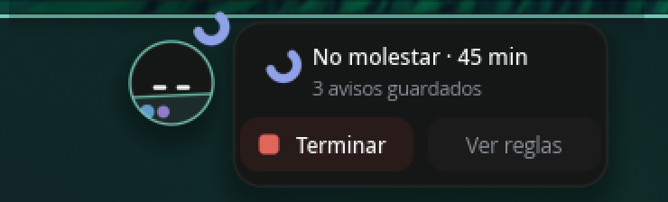

> «Sale una cápsula compacta con estado, avisos guardados, "Terminar" y "Ver
> reglas". Ocupa el lugar de la hora y se repliega al abandonar el conjunto. |
> Apertura 160 ms; cierre 140 ms.»

Ocupa el lugar de la hora **y nace como la hora**: su caja va dentro del cuerpo
de ella, sale de su centro con ancho cero y se desliza a la derecha con un cuello
que nadie dibuja. Comparten silueta, sombra y filo.

Medido: **150 ms** del 1 % al 99 % al abrir y **150 ms** del 99 % al 1 % al
cerrar, con 300 ms de gracia antes de empezar a cerrarse. Un `follow` no sabe de
qué lado viene, así que la ida y la vuelta son dos reglas sobre lo mismo.

Y dice lo que hay: «No molestar · 45 min» con los minutos que quedan de verdad,
«3 avisos guardados» con la cuenta viva, y la tarjeta de Concentración del panel
lee ese mismo estado —«Puesto · 45 min»— en vez de guardar el suyo.

### Volver

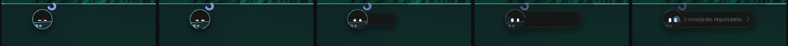

> «La membrana y la luna se disuelven y aparece un único resumen. Las gotas
> normales permanecen ocultas mientras el resumen está visible para no reproducir
> de golpe toda la cola. | Despertar 500 ms; resumen 4,2 s.»

Entrar dura 320 ms y despertar 500: **no es el mismo viaje, así que no es el
mismo muelle**. Medido: `calma` a cero **507 ms** tras el clic en «Terminar»; el
resumen lleno a los **500**, quieto 4,2 s y recogido en 300 más.

El resumen también sale de ella, con su cuello: se ve en los fotogramas 3 y 4 de
la tira. Lo último que hace el Remanso es devolverle lo que guardó, y se lo
devuelve saliendo de ella.

Y se acaba solo: un minuto menos cada minuto (`every 60s while remanso and
queda > 0`) y al llegar a cero sale ella. Un «no molestar» que hay que acordarse
de quitar se queda puesto toda la tarde, y entonces ya no es un remanso sino un
tapón. Medido con `--decir "fact queda 0"`: el resumen arranca **en el mismo
frame**.

### Lo que no está

- **La campana tachada**: aquí la puerta es la tarjeta de Concentración, que es
  lo que hay en la lámina del centro de control. Es la misma acción en otro sitio.
- **El sueño automático suspendido mientras dure**: no hay sueño todavía, así que
  no hay nada que suspender.
- **Las `zZ` de Dormir**, por lo mismo.
- **«Ver reglas»** manda su suceso y la lógica lo apunta: lo que abriría es una
  pantalla que no existe en este prototipo.

### Lo que esto destapó en pleamar

**Con movimiento reducido, lo que iba solo seguía dando vueltas.** El contrato
dice que la marea «se detiene con movimiento reducido», y en pleamar
`--movimiento-reducido` posaba los muelles y congelaba los gestos, pero `blink`,
`wave` y `spin` seguían en bucle: justo lo único que no debe seguir girando. Ya
no: el parpadeo se queda con el ojo abierto, la onda en la mitad de su viaje y el
giro donde estaba. Medido: la marea marca **0,0000 en los 32 fotogramas** de
cinco segundos —y son 32 y no 300 porque, sin nada moviéndose, **duerme**—.

**Y la cuarta vez con las zonas.** La zona de gracia de la cápsula, declarada al
final, se quedó con el clic de «Terminar»; y la de la hora, apagada en Remanso,
hacía dos cosas a la vez: no dejaba pulsar debajo de ella y daba por cierto el
«estás fuera» que apaga la cápsula 300 ms después de abrirla. Ya no es un
despiste: **es una forma de esta escena**, y por eso está escrita en el sitio
donde pasa.

## Su menú, el del botón derecho

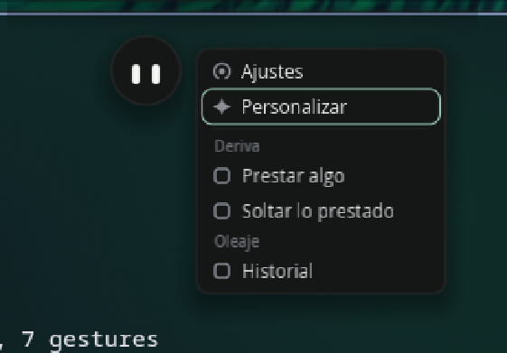

> «El clic abre paneles que se cierran al salir del conjunto mascota–puente–
> tarjeta; **el botón derecho abre su menú**, que se cierra igual al salir de
> ella y del menú. El clic da foco de teclado, pero no los deja pegados a la
> pantalla.»

Hasta ahora el botón derecho no hacía nada aquí, y por eso cerraba el programa:
es la salida de emergencia de pleamar. Ahora hace lo que dice el contrato.

Arriba, las dos filas de la casa —**Ajustes**, que es lo que el clic derecho
abría antes, y **Personalizar**—. Bajo una línea, lo que traen los
complementos, **agrupado por el nombre del suyo**, para que una entrada llamada
«Historial» diga de quién es ese historial. Las de la casa van escritas en la
escena porque son de ella: un complemento no puede quitar Ajustes. Las otras
las manda la lógica —aquí van dichas, que catálogo no hay— con un único dato de
más: si abre grupo. Es una cuenta y no una coordenada; dónde cae cada fila lo
reparte una columna.

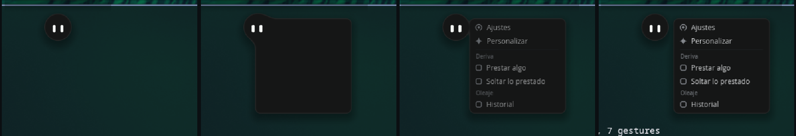

Y nace de ella: su caja va **dentro de su cuerpo**, sale de su centro con ancho
cero y se desliza a la derecha, con un cuello que nadie dibuja —segundo
fotograma—. Es el mismo sitio y la misma caja que la nota de la hora, porque es
lo mismo: lo que ella tiene que decir cuando le preguntas ahí. Abrirlo recoge la
hora, el abanico y la cápsula del Remanso: quien llega último, gana.

Medido: **185 ms** del 1 % al 99 % al abrir, **183** al recogerse, y 300 ms de
gracia al salir del conjunto antes de empezar a cerrarse. Se cierra también con
Esc, con otro clic derecho, al elegir algo y al abrir la tarjeta.

**Dos resaltes distintos porque son dos cosas distintas**: el del puntero
rellena la fila, y el del teclado es un filo de menta. Las flechas mueven la
fila señalada y Enter la elige; Enter sin haber señalado nada coge la primera,
que es Ajustes, así que lo que el botón derecho hacía antes sigue estando a una
tecla. El teclado se pide **solo mientras el menú está abierto** (`keyboard:
on_demand while menuab`), que es lo que el contrato llama no dejarlos pegados a
la pantalla.

### Lo que esto destapó en pleamar

**La salida de emergencia le quitaba el botón a quien lo usara.** El botón
derecho cierra el programa mientras ninguna escena lo use, y en cuanto una lo
usa —`on press right`— desaparecía del todo: no había manera de tener un menú y
poder cerrar el prototipo. Pero quien sabe si el clic ha caído encima de algo es
el render, que es el que mira las zonas. Ahora lo dice él: si debajo del puntero
no había ninguna zona, cierra; si había, el clic es de la escena. Encima de ella
sale su menú, y dos dedos más allá se cierra como siempre.

**Y la quinta vez con las zonas.** La de gracia del menú, declarada después de
sus filas, se quedaba con todos sus clics. Ya no hace falta contarlo otra vez:
en esta escena una zona de gracia va **siempre** debajo de lo que envuelve.

**Y un recorte suelto llega más lejos de lo que parece.** El de la tarjeta se
lleva todo lo que venga detrás hasta la siguiente superficie con nombre, así que
el menú, escrito más abajo, salía recortado a una tarjeta cerrada: una caja
vacía. Su dibujo va ahora antes del recorte y sus zonas siguen al final, que es
donde tienen que estar.

## Medidas de la lámina

De `design/concepts/2026-09-12-reposo-vivo/referencia-real-limpia.png`, que
conserva el tamaño real:

| | |
| --- | --- |
| cuerpo | 46 px de diámetro |
| ojos | 5 × 13, puntas redondas (`corner: 2.5`) |
| separación | 13 px entre centros |
| altura de los ojos | 2,5 px por debajo del centro del cuerpo |

## El buscador: apps, archivos y carpetas

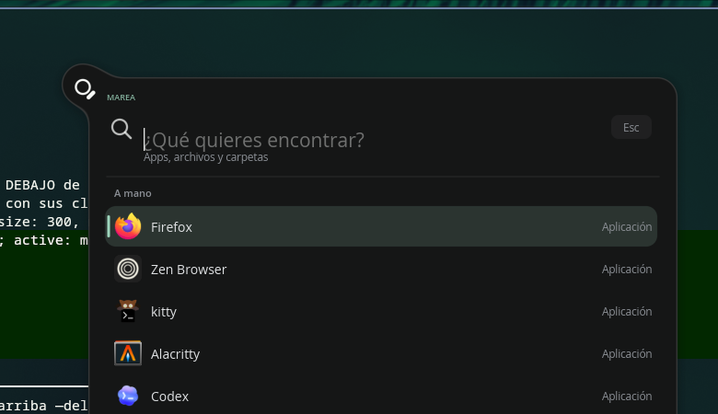

La lámina del cajón de aplicaciones tiene una nota encima, del 31 de agosto:
**«el cajón de iconos queda sustituido como dirección de diseño por el buscador
universal de apps, archivos y carpetas»**. Así que esto no es una rejilla de
iconos: es lo que la sustituyó, y la lámina de la secuencia lo cuenta en seis
tiempos —reposa, se aparta, **busca**, encuentra, abre y se recoge—.

Lo que lo hace suyo y no un lanzador cualquiera es el tercero.

### Sus ojos se vuelven una lupa

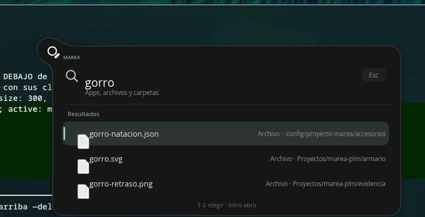

El aro es el ojo izquierdo abierto hasta 17,4 y vaciado por dentro con un disco
del color de su cuerpo —el mismo truco que el diafragma de la cuenta atrás:
aquí todo son distancias, y **un agujero es una forma más**—. El mango es el
derecho, estirado a 4,4 × 11,6, girado 45° y corrido a la esquina del aro. Y los
dos se van al centro, porque una lupa no tiene dos sitios.

No hay ninguna cara nueva: es el paso 8 de **la misma cadena** que lleva el ojo
al nivel, a la cuenta, a la cámara, al disco de grabar, a la admiración, al
trazo del Remanso y a la rayita de dormir. La cara no se cambia por otra: se
dobla hasta ser otra cosa.

### Y el panel sale de ella, como todo lo demás

640 de ancho —los 780 de la lámina por 46/56— y **de alto lo que pida su lista**:
`follow bh = 176 + lista.height`, así que crece y se encoge mientras escribes en
vez de dejar un hueco negro esperando. Dentro, lo de la lámina: «MAREA», el
campo con su lupa y su «Esc», «Apps, archivos y carpetas», y el pie con
«↑↓ elegir · Intro abrir».

Tres cosas que no se ven en una captura:

- **La selección es una sola marca que viaja.** No es una fila que se enciende y
  otra que se apaga: es un muelle que se mueve a la fila elegida, así que con
  las flechas se lee como mover algo.
- **La lista entra escalonada**, con **un solo muelle**: `pase` va de 0 a 1 y
  cada fila se sirve de él con su índice restado (`clamp(pase * 8 - índice, 0, 1)`).
  Es lo mismo que hace el oleaje de la bandeja, y por lo mismo: una lista que
  aparece entera de golpe es una tabla, no algo que llega.
- **Al abrir algo, se pone contenta**: un guiño corto y un salto, 600 ms. Lo que
  celebra es haberlo encontrado.

### Lo que hay debajo

Las aplicaciones son **las de verdad**: el servicio `apps` de pleamar lee los
`.desktop`, con su icono y su orden, y `apps.launch` las abre. Los archivos y
las carpetas los busca `fd` por debajo de tu casa, con tres reglas que salieron
de verlo funcionar:

- **Con menos de tres letras no se busca.** `fd` con una letra devuelve media
  casa —miles de rutas que ni caben ni dicen nada— y lo único que consigue es
  que la lista dé un salto por cada tecla.
- **Lo que vuelve tarde se tira.** Se apunta la consulta con la que se lanzó y,
  si al volver ya no es la de ahora, se descarta: sin eso, escribir deprisa deja
  la lista de hace tres letras.
- **«A mano» no es «las primeras del abecedario».** Sin datos de uso, una lista
  corta de las de siempre ordena mejor que el orden alfabético, que empezaba en
  «Avahi SSH Server Browser».

### Tres cosas que esto destapó

**Un recorte suelto se lleva lo que venga detrás.** El del buscador se comió el
menú entero —escrito más abajo— y con él sus zonas: pulsar «Buscar…» no hacía
nada. Ya está dicho en la guía y ha vuelto a pasar; ahora cada recorte va dentro
de su grupo, que es donde acaba.

**Pedir el teclado entero mueve el puntero.** Con `keyboard: exclusive`, el
compositor reconfigura la superficie y manda un «el puntero se ha ido»: con el
ratón quieto, el menú se cerraba solo 300 ms después de abrirlo, porque su zona
de gracia dejaba de tener a nadie dentro. Al buscador se entra pulsando, así que
`on_demand` basta y el puntero se queda donde está.

**El `at` de una imagen es su esquina, no su centro** —al revés que una caja o
una figura—. Centrado como si fuera un centro, el icono salía 8 px por debajo de
su fila. Dicho ya en la referencia de pleamar, que no lo decía.

## Dormir

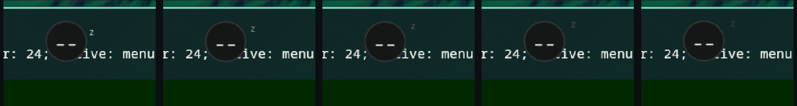

> «**Adormecerse**: bajan los párpados, cabecea suavemente y se acomoda. 1,24 s.
> Empieza al pulsar «Dormir» o tras 45 s inactiva.»
> «**Dormida**: ojos como rayitas, respiración leve y «z» discreta. Ciclo de
> 3,6 s.»

Dormir no es el Remanso, y por eso son dos cosas y no un interruptor con dos
nombres: en Remanso **sigue despierta y atenta** —los ojos bajan a dos trazos y
no se cierran—, y aquí no está. De ahí sale lo demás: el sueño automático queda
suspendido mientras dure el Remanso, porque está concentrada, no ausente.

| | |
| --- | --- |
| dormirse | **1 217 ms** medidos (contrato: 1,24 s) |
| despertarse | 380 ms — nadie se despierta despacio cuando le llaman |
| el cabeceo | 420 + 380 + 440 = los 1 240 ms del contrato, en tres tiempos |
| la respiración | una **`posture`**: se repite sola mientras sea verdad y se calla cuando deja de serlo. Ciclo de 3,6 s y 1,1 px de recorrido, contra los 2 de despierta |
| la «z» | una cada 3,6 s: sube, se abre y se deshace |

Dos cosas que el sitio decidió por sí mismo. La **«z» va a su lado y no encima**:
ahí arriba está el borde de la pantalla —la misma razón por la que las gotas
bajan por su hombro—, y sobre su cabeza salía medio cortada. Y **«Dormir» vive
en su menú**: en Marea son las `zZ` del centro de control, pero el centro de
aquí es el de la lámina —tres tarjetas, y ninguna es esta—, así que va con
Ajustes y Personalizar, que es donde están las cosas que hace ella.

### Llega uno y está dormida

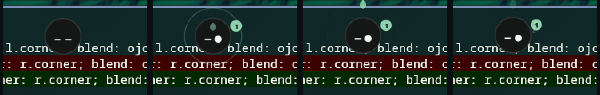

> «**No la despierta.** Una gota del color de quien escribe se forma colgando
> del borde encima de su cabeza, se suelta y se hunde en ella; sale una onda de
> ese color, la gota de su lado late y ella abre **solo el ojo derecho** hacia
> esa gota, lo cierra y respira un poco más hondo. Uno crítico sí la despierta y
> abre la bandeja. | Goteo 420 ms + 90 ms colgando + caída 190 ms InQuad. Onda
> 760 ms. Ojo 280 ms, abierto 700 ms.»

Ni tarjeta, ni salto, ni apertura. La gota se forma en el borde de arriba —del
mismo sitio del que cuelga ella cuando está hundida, porque es la misma agua—,
se suelta y se hunde; de donde ha caído sale un anillo de su color, y su gota
del hombro late. Medido: **367 ms** en formarse, **317** entre soltarse y estar
dentro (90 de colgar + 190 de caída), **684 ms** en total; el ojo abre en
**283 ms** y se cierra **950** después.

Y lo que la gota trae lo cuenta al **entrar**, no al mandarse: el `direct` que
sube la cuenta va en el suceso de haberse hundido. La gota **es** el aviso
llegando, así que la cuenta sube cuando entra.

Lo demás que dormir se lleva por delante, que estaba escrito en otras filas del
contrato y no se cumplía porque no había sueño: la hora no sale dormida, el
nivel en la cara tampoco —la tecla del volumen no va dirigida a ella— y un
urgente es lo único que tiene permiso para despertarla.

## El armario: un accesorio no es un dibujo pegado encima

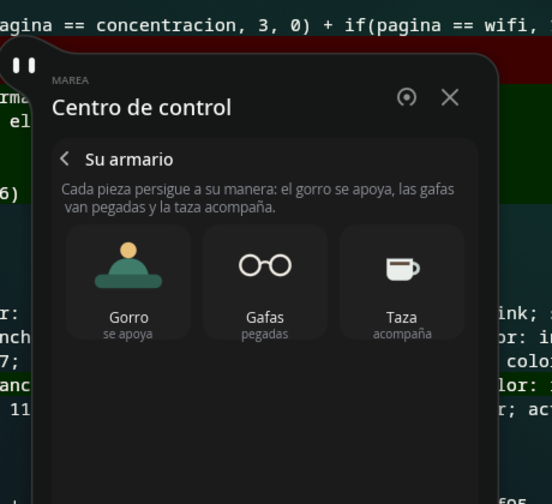

> «Un accesorio no es un dibujo pegado encima de la bolita. Es una pieza aparte,
> con su geometría, su pivote y sus capas separables… **la personalidad vive en
> la pieza, no en la cara**: no hace falta inventar estados de ojos para que se
> note que está investigando; basta con que el gorro le llegue un poco tarde.»

Se dibuja un SVG con sus capas nombradas, se suelta en `armario/` y ya está: es
un `figure` de pleamar, así que cada capa es un **camino de verdad** —se tiñe,
se funde, gira sobre su pivote y escala sin píxeles—, y tocar el fichero lo
recarga en pantalla sin tocar la escena.

### Las zonas no son sitios, son físicas

Lo que hace que una pieza sea suya no es dónde se dibuja: es **cómo persigue**.
Eso es toda la biblioteca (`comun/accesorios.plm`), y la pieza va dentro, así que
la física no sabe qué lleva puesto.

| | cómo persigue | quién la usa |
| --- | --- | --- |
| `Apoyado` | muelle poco frenado: llega tarde, rebasa y se asienta. Persigue **la mirada** además del cuerpo | el gorro |
| `Pegado` | nada: cuelga de su cuerpo y el giro, el aplastamiento y el salto le llegan gratis | las gafas |
| `Acompana` | muelle blando, con más manga ancha, y flota aunque ella esté quieta | la taza |

«La bolita sigue al cursor; el gorro sigue a la bolita»: si lo que ella hace
para seguirte es **mirar** —esta bolita no gira la cabeza, gira mirando—, eso es
lo que el gorro tiene que perseguir, o se queda quieto justo cuando más se
espera que se mueva. Por eso la mirada entra en el objetivo con su propio factor.

Y el retraso, en unas gafas, sería que se están resbalando. Por eso `Pegado` no
persigue nada: colgado de su cuerpo, lo hereda todo. Lo que se le pasa es el
giro y el aplastamiento **de ella, con su centro por pivote**, y la pieza se
coloca dentro: así el aplastamiento la aplasta como aplasta a la cara, y no
alrededor de sí misma.

**Y una pieza pegada se mide sobre la cara que lleva debajo, no sobre sí
misma.** Sus ojos miden 5 × 13 y están a 13 px entre centros, 2,5 por debajo de
su centro: los cristales son óvalos a ±6,5 que los contienen con holgura, y el
SVG está dibujado 1:1 con los píxeles a los que se pinta para que eso se lea de
un vistazo. Estaban 2 px por **encima** y con media mirada, así que se le
quedaban en la frente y miraban a otro lado. Ahora dónde está su cara se dice
una sola vez —`cara.dx`, `cara.dy`, `cara.baja`— y lo usan la cara y lo que se
le pega: escrito dos veces, unas gafas se descuadran en cuanto alguien toca uno
de los dos sitios.

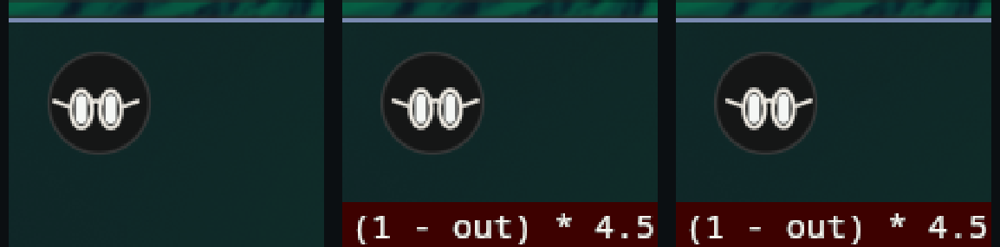

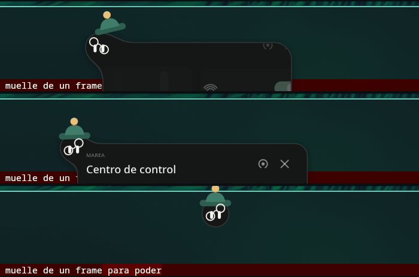

### Que acompañe y que llegue tarde son dos pruebas distintas

El contrato lo dice con todas las letras, y por un motivo: la prueba antigua
comprobaba que la pieza no estuviera donde el cuerpo, y **eso se cumple igual si
la pieza no se mueve nunca**; con el gorro clavado pasaba en verde. Medido por
separado, con ella cruzando media pantalla al abrir el panel:

| | |
| --- | --- |
| acompaña | **0,00 px** de error en reposo |
| llega tarde | **16,0 px** de retraso máximo |

Los 16 son el tope a propósito. El muelle sigue siendo el muelle —de ahí salen
el retraso, el rebase y el asentamiento—, pero lo que se le nota va acotado: sin
tope, un viaje de 240 px en 290 ms dejaba el gorro a **150 px** de su cabeza, y
eso ya no es llegar tarde, es habérselo dejado en el otro lado.

### Lo que sale gratis

- **El ángulo no se anima: es el retraso.** `rotate: clamp(dx, -9, 9) * 1.5deg`,
  con `dx` lo que va atrasado. Si no llega tarde, no se inclina.
- **El «¡ajá!» no es un caso especial**: es el rebase pasando de un umbral
  (`on change dx > 7`), y lo que hace es un respingo de 5 %.
- **Ponérselo es dejarlo caer**: sin poner, la pieza espera 44 px más arriba, y
  `puesto` es un muelle vivo. Medido: **250 ms** desde el clic hasta que se posa.

Se elige desde **«Personalizar»**, en su menú: abre el panel con su armario, y
lo que se ve de cada pieza es **la pieza de verdad** —el mismo SVG, no un icono
suyo—, así que el día que dibujes otra aparece ahí sin tocar nada.

### Lo que esto destapó en pleamar

**Un SVG solo podía entrar como estampa.** Rasterizado en un atlas se ve, pero
no se funde con nada, no se tiñe por partes, no se anima por capas y al escalar
es píxeles: justo lo contrario de lo que un accesorio necesita. Ahora está
`figure`, que lee el mismo fichero como caminos con el `usvg` que ya estaba
dentro por las imágenes. `figure hat { … }` es la pieza entera y
`figure hat.ala { … }` una capa **en su sitio dentro de la pieza**, así que dos
capas dibujadas por separado siguen encajando: es lo que deja que el ala gire y
la corona no.

**Y `--registrar` no decía qué nombres hay.** Un nombre que no existe se
apuntaba como `?` durante toda la medición, sin saber si estaba mal escrito o es
que la escena no lo movía. Dentro de una copia los nombres llevan su marca
(`px#Apoyado2`) y eso no hay quien lo adivine: ahora lo dice al empezar, con los
que se le parecen.

## El cerco negro, el halo que no hizo falta, y el filo

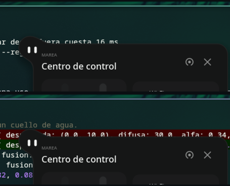

Alrededor de ella había un círculo negro más grande que ella, y al abrir el
centro de control, una mancha oscura por encima del panel hasta el borde de la
pantalla. Era su sombra: negra, difusa 16, desplazada 7. **Una sombra negra
sobre un escritorio de ventanas oscuras no tiene nada que oscurecer**, y lo
único que hace es ensuciar lo que hay detrás.

Marea ya pasó por aquí y en su tema le da la vuelta: quita la sombra y pone un
halo claro, sin desplazamiento, que abraza el contorno. Aquí se probó y **no
era la respuesta**: de blanco al 45 % era una sombra blanca —el mismo problema
con otro color— y de menta al 22 %, un resplandor verde que se veía sobre
cualquier fondo que no fuera negro. Un halo pinta fuera de la silueta, y lo que
pinta fuera se ve.

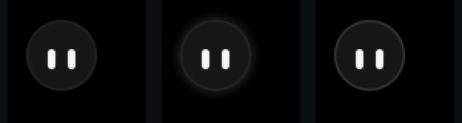

Lo que sí hacía falta es lo que el halo venía a tapar: **sobre un fondo oscuro
de verdad ella desaparece**. Su cuerpo es `#151616` y sobre negro no hay
diferencia que ver (primer fotograma). Pero para eso no hace falta pintar nada
fuera: su `rim` es luz por **dentro** de la silueta, y subido del 6 % al 14 %
(tercero) la dibuja entera sin tocar un píxel del escritorio. El del medio es
el halo, para comparar.

Así que la bolita no lleva ni sombra ni halo. Lo que sí lleva sombra es un
panel, que es una tarjeta de 390 × 410 flotando sobre las ventanas y tiene que
decir que está encima. Y como **todo lo de una sombra es una cuenta**, aparece
con la tarjeta y se va con ella:

```plm
let panel = clamp(max(card, tray) * 2, 0, 1)
shadow: 0, 2 * panel, 12 * panel, 32% * panel, #05070a
```

Con `panel` a cero no hay sombra que calcular: el render ni la mira.

## Lo que le faltó al lenguaje, y ya no

Dieciocho, todas arregladas en pleamar en vez de esquivadas aquí:

1. **No había forma de comprobar un tiempo.** Sondear desde fuera cuesta 16 ms
   por lectura, que es un frame entero. Ahora está `--registrar`.
2. **`blink` contaba el periodo desde que abría el ojo**, así que «cada 5,2 s»
   salía 5,33. Ahora cuenta de comienzo a comienzo, y acepta un solo periodo.
3. **No se podían escribir los tiempos.** El contrato está en milisegundos y en
   pleamar solo había muelles, que llegan cuando llegan. Ahora un muelle se puede
   decir en tiempo: **`~620ms`** es el que llega en ese rato sin rebotar. Medido:
   619 ms.
4. **Lo ambiental pisaba a los gestos.** La respiración lleva su propio
   parpadeo, y el de reposo caía encima: dos parpadeos en segundo y medio. Ahora
   un gesto manda, y el reloj de lo ambiental se congela mientras dura.
5. **Una sombra que no cabía se cortaba sin decir nada.** Ahora el render lo
   dice, una vez, cuando la cuenta deja de crecer.
6. **El empujón no podía depender de nada.** `impulse` solo aceptaba un número
   escrito, y el contrato pide un rebote que **decrece** con la cuenta. Ahora es
   una expresión que se evalúa al dispararse: `impulse pop left * 2.5`.
7. **`every … while x` contaba su espera mientras `x` era falso**, así que la
   cuenta atrás daba su primer paso a los 300 ms —lo que quedara del reloj de
   antes—. Ahora el reloj se pone entero mientras no se cumple.
8. **Una regla no podía ver lo que otra acababa de hacer.** Las reglas se miran
   todas antes de aplicar nada, así que un `on change` lo ve al frame siguiente;
   y con nada moviéndose, «el siguiente» era la próxima cita: **un segundo más
   tarde**. La cuenta pasaba al disco rojo un segundo después de su último
   número. Ahora, tras un efecto, hay un frame más garantizado: 17 ms.
9. **No había seno ni coseno**, así que nada podía ir por un arco. Ahora
   `sin(deg)` y `cos(deg)`.
10. **El render se paraba 300 ms en mitad de una animación** (arriba, en «Lo que
    esto destapó»).
11. **Una superficie no podía esperar a lo que lleva dentro.** `open:` solo
   aceptaba un hecho; ahora una cuenta: `open: tuck > 0.01`.
12. **Un `clip` suelto recortaba también la otra ventana**, y no se veía nada sin
    que nada lo dijera. Costó una hora encontrarlo. Ahora los recortes abiertos
    acaban donde empieza una superficie con nombre.
13. **No se podía decir «cuando esto lleve un rato sin cambiar».** El contrato lo
   pide en tres sitios —el nivel aguanta 1,1 s tras el último cambio, la nota de
   la hora 300 ms de gracia, el aviso 700— y en pleamar solo existía `on change`,
   su reverso. Con él, una ráfaga de teclazos salía como un parpadeo por
   escalón. Ahora está **`on still x for 1.1s`**: cada cambio pone el reloj a
   cero, así que la ráfaga es una lectura continua, y lo que dispara ocurre una
   vez al acabar. Medido: 1 102 ms tras el último cambio, y sin gastar un frame
   esperando.
14. **Lo que iba solo seguía dando vueltas con movimiento reducido.**
   `--movimiento-reducido` posaba los muelles y congelaba los gestos, pero
   `blink`, `wave` y `spin` seguían en bucle —lo único que de verdad no debe
   seguir girando—. Ahora el parpadeo se queda abierto, la onda en la mitad de
   su viaje y el giro donde estaba. Medido: la marea marca 0,0000 en los 32
   fotogramas de cinco segundos, y son 32 porque sin nada moviéndose duerme.
15. **La salida de emergencia le quitaba el botón derecho a quien lo usara.**
   Cerraba el programa mientras ninguna escena usara ese botón, y en cuanto una
   lo usaba desaparecía del todo: o menú, o poder cerrar el prototipo. Ahora lo
   decide el render, que es quien mira las zonas: si el clic no cayó encima de
   ninguna, cierra. Encima de ella sale su menú; dos dedos más allá, se cierra.

16. **Una sombra solo podía ser negra, y sus números eran fijos.** Una sombra
   negra sobre un escritorio de ventanas oscuras no tiene nada que oscurecer:
   se ve como un cerco sucio alrededor de lo que quería separar del fondo.
   Ahora `shadow` lleva color, y **todo lo suyo son expresiones**. Con un solo
   juego de números había que elegir entre lo que quiere una bolita y lo que
   quiere un panel de 390 × 410, siendo el mismo cuerpo; ahora la sombra
   aparece con la tarjeta y se va con ella (`32% * panel`), y con la cuenta a
   cero el render ni la mira. El color va en los tres huecos que `color1` ya
   tenía libres, así que no cuesta ni un byte más por elemento.

17. **Un SVG solo podía entrar como estampa.** Rasterizado en un atlas se ve,
   pero no se funde con nada, no se tiñe por partes, no se anima por capas y al
   escalar es píxeles. Ahora está `figure`: el mismo fichero leído como
   caminos, por capas, con el `usvg` que ya estaba dentro por las imágenes. Y
   se vigila como una biblioteca: dibujas el gorro, guardas, y está puesto.
18. **`--registrar` no decía qué nombres hay.** Un nombre que no existe se
   apuntaba como `?` toda la medición. Dentro de la copia de un componente los
   nombres llevan su marca (`px#Apoyado2`) y eso no se adivina: ahora lo dice al
   empezar, con los que se le parecen.

## Lo siguiente

Del contrato de la bolita ya no queda nada grande por hacer: el oleaje entero,
el Remanso, dormir, el centro de control, su menú y el armario están puestos y
medidos. Lo que viene ahora es de otro capítulo:

- **Las notificaciones de verdad**, que hoy son una tanda inventada. pleamar
  sabe traerlas; falta darle el permiso, y decidir qué pasa cuando el sitio ya
  es de Marea.
- **El pulso del sistema** (`Actualiza`, `Trabaja`): el anillo ámbar que gira,
  las marcas que orbitan, los dos vistos de «al día». Estrena `spin` y, sobre
  todo, pide pasar la cara a `layer`, que es el refactor que más ordenaría el
  fichero.
- **De la vista previa del buscador**: la lámina 02 enseña el documento elegido
  con su contenido al lado. Eso pide leer el fichero, que es de la lógica, y
  decidir qué se enseña de un vídeo o de una imagen.
- **Abrir un archivo de verdad**: hoy una aplicación se lanza y un archivo solo
  se apunta en el log. Falta `xdg-open`, que es una línea y una decisión.
